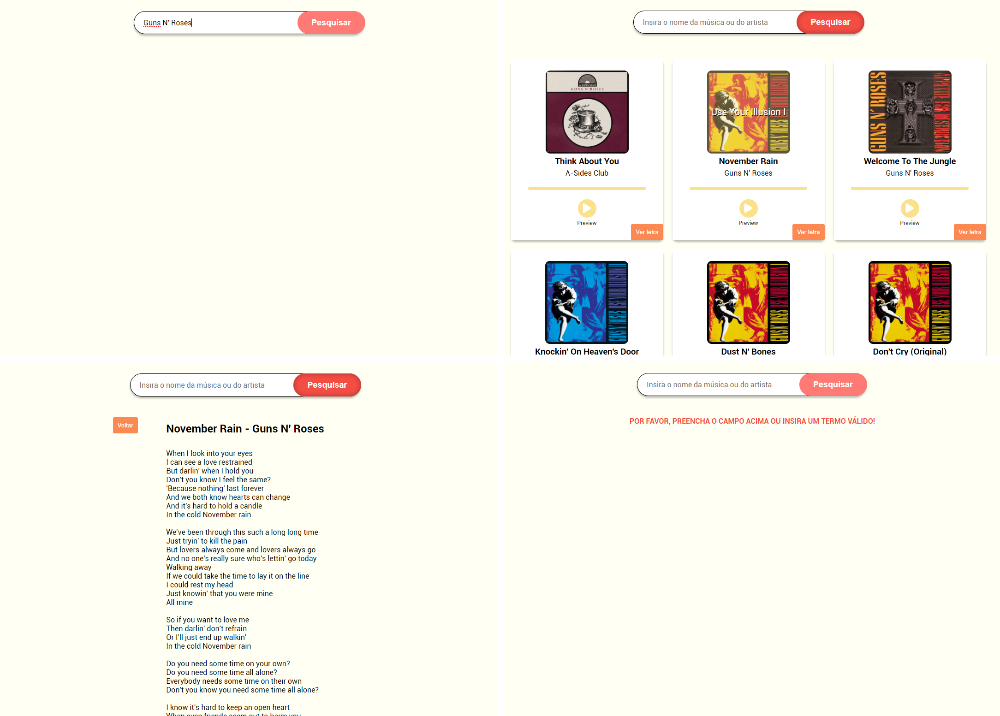
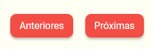

# O Projeto
Projeto para pesquisar letras de músicas/bandas através da API do Deezer e Vagalume, com adicional de mostrar prévia das músicas, nome e imagem do álbum.

A criação desse projeto foi para aprimorar e por em prática o meu conhecimento na linguagem JavaScript.

 - O botão <b>Próximas</b> aparece se o resultado da pesquisa for maior que 25, ao clicar nele irá carregar mais músicas relacionadas à pesquisa feita pelo usuário.
 - O botão <b>Anteriores</b> aparece ao clicar no botão <b>Próximas</b>, para que o usuário volte para as músicas anteriores.

<a href="https://iammatheus.github.io/search-lyrics-two-api">Visualizar Projeto</a>

 

## Porque utilizar duas API?
Inicialmente o projeto estava sendo desenvolvido com a API 
<a href="https://lyricsovh.docs.apiary.io">Lyrics Ovh</a> e nela eu obtia todas as informações que eu precisava, mas ela está em manutenção, então eu migrei o projeto para a API do 
<a href="https://developers.deezer.com/api">Deezer</a>, que não fornece as letras e utilizei a API do <a href="https://api.vagalume.com.br/docs">Vagalume</a> para obter elas.

API Deezer utilizada para obter: 
  - Nome do artista
  - Nome da música 
  - Nome e imagem do álbum
  - Prévia da música

API Vagalume utilizada para obter:
  - Letra das músicas

 

## Desenvolvimento
  - Javascript
  - HTML
  - CSS3
  - Visual Studio Code